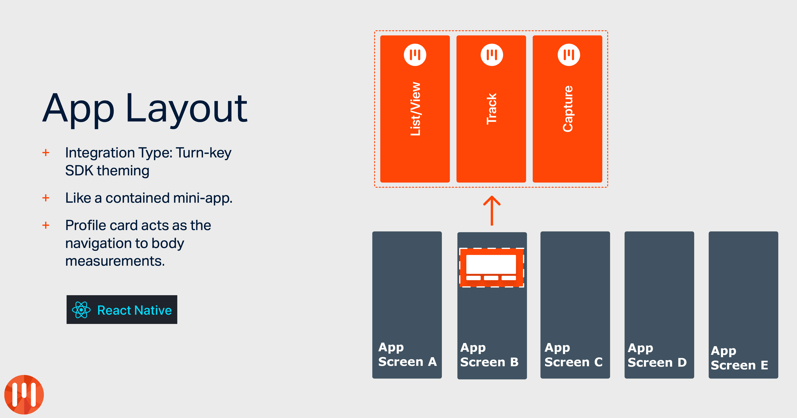

# MyFiziq Turnkey : React Native : Example

MyFiziq Turnkey is intended to be a base template that can be forked and customised according to the integration planned. This saves developers the need to implement boilerplate integration code for adding MyFiziq technology to an existing app.

Please refer to the MyFiziq React Native Turnkey plugin repo for more details: [react-native-myfiziq-turnkey](https://github.com/MyFiziqApp/react-native-myfiziq-turnkey)

## Author

MyFiziq iOS Dev, dev@myfiziq.com

## License

MyFiziqSDK is Copyright 2016-2020.

